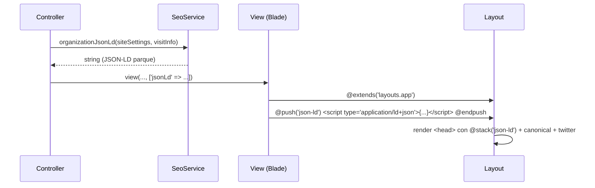
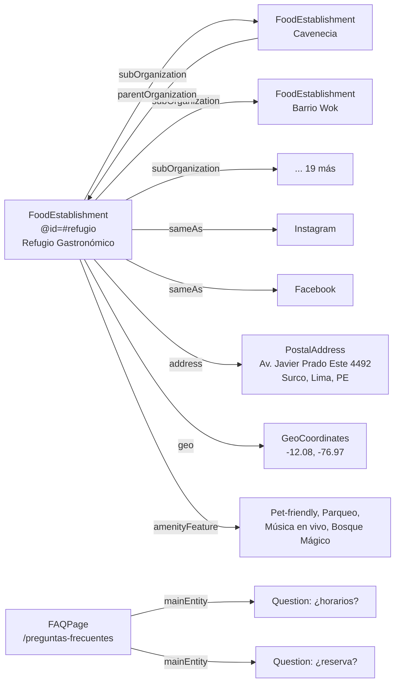

# Design: Estrategia GEO para Refugio Gastronómico

## Decisiones de Arquitectura

### AD1 — Servicio dedicado `SeoService` (no helpers sueltos)
**Decisión:** Centralizar la generación de JSON-LD en `app/Services/SeoService.php`.
**Rationale:** Un solo punto de verdad para entidades del parque y conceptos; reutilizable desde controladores y vistas vía `@stack('json-ld')`. Evita duplicar lógica de schema en Blade. Refleja el patrón existente (`app/Services/Scraper/*`).
**Alternativas descartadas:** Componente Blade por página (duplicación), helper global `seo()` (menos testeable).

### AD2 — Inyección vía `@stack('json-ld')` en el layout
**Decisión:** Añadir `@stack('json-ld')` al `<head>` de `layouts/app.blade.php`; cada página hace `@push('json-ld')` con el JSON-LD que el `SeoService` genera.
**Rationale:** Mínimamente invasivo, respet el SSR Blade existente, no acopla el layout a un modelo concreto. Las páginas sin push simplemente no emiten schema.

### AD3 — Modelo de entidad: parque como `FoodEstablishment` con `subOrganization`
**Decisión:** El parque se modela como `FoodEstablishment` (no `Organization` pura) con `@id` estable `#refugio`, `address`, `geo`, `openingHoursSpecification`, `amenityFeature`, `sameAs` y `subOrganization` → 21 `FoodEstablishment`.
**Rationale:** Un food park es un establecimiento de comida que agrupa otros. `FoodEstablishment` permite `servesCuisine`, `menu`, `priceRange`. Los conceptos no tienen NAP propio (correcto para food hall) → se enlazan vía `parentOrganization`/`subOrganization` y `@id`.
**Corrección vs. proposal:** NO se toca `/contacto`. El 404 es **intencional** (contacto fusionado en home con ancla `id="contacto"`), afirmado por tests `test_legal_and_mirrored_pages_return_ok_with_fallback` (`assertNotFound`) y `test_header_nav_matches_sdd` (sin enlaces a `/contacto`). Respetar la arquitectura existente.

### AD4 — Horarios como texto libre (no `OpeningHoursSpecification` rígido)
**Decisión:** El `schedule` de `VisitInfo` es texto libre en español ("Domingo a Miércoles hasta las 10 p.m."). No se fuerza `OpeningHoursSpecification` con `dayOfWeek`/`opens`/`closes` porque el formato actual no es parseable a 24h sin pérdida. Se emite `openingHours` (texto) y se deja `OpeningHoursSpecification` para una fase posterior cuando el CMS capture horarios estructurados.
**Rationale:** Schema inválido perjudica más que ayuda. Honrar la regla "schema que refleje contenido real".

### AD5 — FAQPage solo donde hay FAQ real
**Decisión:** Emitir `FAQPage` en `/preguntas-frecuentes` (bloque `type=faq` existe) y, opcionalmente, en detalle de restaurante si se añade FAQ por concepto (Fase 2). No inyectar `FAQPage` en páginas sin Q&A.
**Rationale:** Regla GEO 2026 (Google mayo 2026): no añadir `FAQPage` a páginas sin FAQ real; ya ni da rich snippet. La fuente de Q&A es `config/static-pages.php` `faq.blocks[type=faq].items` (o `StaticPage` si existe en BD).

### AD6 — Sitemap generado por comando Artisan (estático a disco)
**Decisión:** `php artisan refugio:sitemap` escribe `public/sitemap.xml`; ruta `GET /sitemap.xml` lo sirve. No se genera por-request (costo).
**Rationale:** Descubribilidad para crawlers clásicos y de IA. Se re-genera tras cambios de contenido (manual o tras seed/import). Se añade a `public/robots.txt` la línea `Sitemap:`.

### AD7 — `llms.txt` como archivo estático versionado
**Decisión:** `public/llms.txt` curado a mano, no generado. Refleja la oferta del parque y enlaces clave.
**Rationale:** Bajo esfuerzo, experimental. Google no lo usa, pero otros motores/agentes sí. Mantener claims veraces y actualizados.

### AD8 — Canonicals y Twitter Cards en el layout (globales)
**Decisión:** `<link rel="canonical">` + `twitter:card|title|description|image` en `layouts/app.blade.php`, usando `url()->current()` y `siteSettings`.
**Rationale:** Aplican a todas las páginas; no requieren push por página.

## Diagrama de Secuencia — Render de página con JSON-LD

## Diagrama de Entidades Schema

## Áreas Afectadas (detalle)

| Área | Cambio |
|---|---|
| `app/Services/SeoService.php` | **New** — generadores de JSON-LD |
| `resources/views/layouts/app.blade.php` | `@stack('json-ld')`, canonical, twitter cards |
| `app/Http/Controllers/HomeController.php` | push JSON-LD parque |
| `app/Http/Controllers/RestaurantController.php` | push JSON-LD parque + concepto + BreadcrumbList |
| `app/Http/Controllers/StaticPageController.php` | push FAQPage en `/preguntas-frecuentes` |
| `app/Http/Controllers/EventController.php` | push Event schema (si aplica) |
| `app/Console/Commands/GenerateSitemapCommand.php` | **New** |
| `routes/web.php` | ruta `GET /sitemap.xml` |
| `public/robots.txt` | añadir `Sitemap:` |
| `public/llms.txt` | **New** |
| `tests/Feature/SeoTest.php` | **New** — asserts de schema/canonical/sitemap |

## Supuestos y Dependencias

- `SiteSetting::current()` y `VisitInfo::current()` ya están disponibles en todas las vistas (composer global en `AppServiceProvider`).
- Coordenadas y dirección provienen de `VisitInfo` (default `-12.0842658, -76.9734978`, `Av. Javier Prado Este 4492`).
- No se requiere migración de BD: todo se genera desde modelos existentes. Atributos dietéticos/ocasión se dejan para Fase 2 (requieren campos nuevos en BD/CMS).
